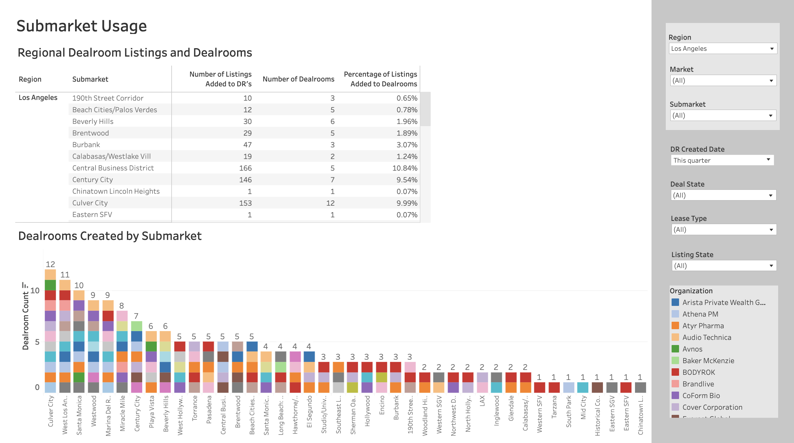

# 📊 Jaspreet Mand  
### Data Analyst | Turning Raw Data into Actionable Insights  

  
  
  

---

## 🌟 Highlights
- Dashboards for **executive reporting**, **market analysis**, and **board decks**  
- Skilled in **Tableau, SQL, Excel**  
- Metrics designed for **clarity, speed, and impact**

---

## 📊 Key Metrics Snapshot
| Metric                      | Value     |
|-----------------------------|-----------|
| Requests Tracked (QTD)      | 129       |
| Clients Covered (YTD)       | 109       |
| Max Monthly Buildings Added | 965       |
| Peak Weekly Abstracts       | 40        |

---

## 📂 Project Gallery  

| Project | Preview |
|---------|---------|
| [**Portfolio Management Tracking**](portfolio-management-tracking/README.md)   Centralized metrics for executives and client reporting |  |
| [**Submarket Usage**](submarket-usage/README.md)   Market-level dashboard for hiring & resource planning |  |
| [**Listing & Building Metrics**](listing-building-metrics/README.md)   Auto-updating tables for board decks |  |

---

## 📬 Contact
- 📧 **Email:** [jaspreet.mand22@gmail.com]  
- 💼 **LinkedIn:** [https://linkedin.com/in/your-profile](http://www.linkedin.com/in/jaspreet-mand)  
- 🖥️ **GitHub Repo:** [github.com/jaspreetmand/data-analyst-dashboards](https://github.com/jaspreetmand/data-analyst-dashboards)  

---

⭐️ *Thanks for visiting my portfolio!* ⭐️  

