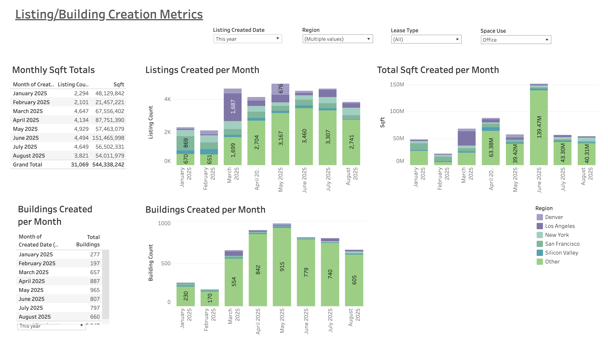

# Listing & Building Creation Metrics Dashboard

## Business Question
How are new property listings and building additions trending by month, and which regions are driving total square footage growth?  
Purpose: Provide quick, auto-updating tables and charts for board decks, so that metrics are always current for recurring meetings.

## Dataset
- Source: Real estate listing database (anonymized).  
- Granularity: Monthly aggregated listing and building records, with square footage by region.  
- Period Covered: Jan–Aug 2025.  
- Key Metrics: Listings Count, Buildings Created, Total Sqft Created.  

## Approach
- Time-series bar charts of listings, buildings, and square footage per month.  
- Segmentation by region (e.g., Denver, LA, NY, SF, Silicon Valley, Other).  
- Cross-tab with monthly totals for transparency.  

## Key Insights
- Strong growth in mid-2025: June hit the highest volume with ~965 buildings created and ~139M sqft added.  
- Region contributions: Los Angeles and New York consistently lead, while Denver contributes smaller volumes.  
- Steady pipeline: Monthly listings hover between 2,500–5,000, sustaining ~50M–150M sqft growth per month.  

## What I'd Do Next
- Add year-over-year comparisons to contextualize trends.  
- Build forecasting model for listings and sqft based on seasonality.  
- Incorporate average deal size (sqft per listing) for more granular insights.  

## Tech Stack
- Tableau (visualization)  
- SQL (data preparation)

