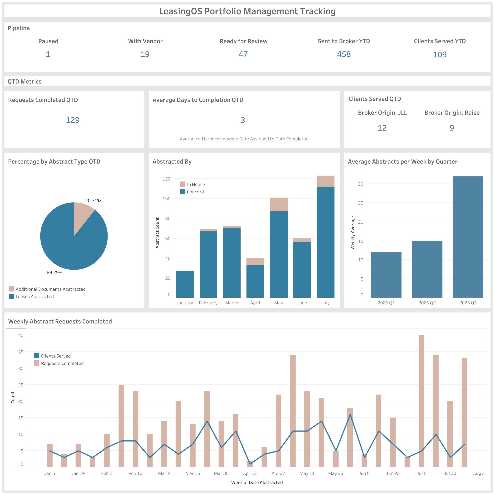

# Portfolio Management Tracking Dashboard

## Business Question
How can the portfolio management team track document abstraction requests, turnaround times, client service levels, and overall pipeline health?  
Another purpose of this dashboard is to give executives and managers high-level visibility into KPIs, enabling quick check-ins and executive reporting. 
Because the process is complex, centralizing metrics in a single dashboard ensures readiness for presentations at any time.

## Dataset
- Source: Internal portfolio/lease management system (anonymized).  
- Granularity: Request-level records with assigned/complete dates, abstract type, and responsible team.  
- Period Covered: At least Q1–Q3 2025.  
- Key Metrics: Requests Completed, Days to Completion, Clients Served, Abstract Type Distribution.

## Approach
- Aggregated abstraction requests by status, completion time, and origin.  
- Used bar/line charts to show trends over time and pie chart for abstract type distribution.  
- Segmented by in-house vs vendor to evaluate outsourcing efficiency.  

## Key Insights
- Easy visibility into the **pipeline**, showing how many requests are paused, with vendor, ready for review, etc.  
- High throughput: 129 requests completed quarter-to-date with an average 3-day turnaround.  
- Client coverage: 109 clients served YTD, with significant volume from key broker origins.  
- Team allocation: Vendor handling supplements surges in workload.  
- Growth in demand: Weekly abstracts show a rising trend in Q3 2025, which helps prepare new timelines to share with clients as turnaround time will likely increase.  

## What I'd Do Next
- Add drilldowns into request-level detail (by client, broker, or document type).  
- Create alerts for when requests remain "With Vendor" beyond SLA.  
- Compare efficiency of vendor vs in-house processing.  
- Add **cost metrics** to track spend vs. value.  

## Tech Stack
- Tableau (visualization)  
- SQL (data preparation)

